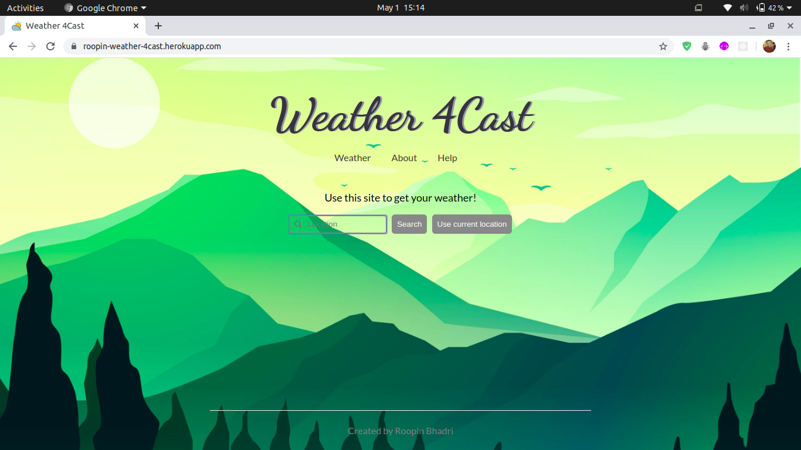

# Weather 4Cast

  &nbsp;&nbsp;
  &nbsp;&nbsp;

Use this site to get real-time weather :partly_sunny: details for any location across the globe :earth_americas: .
This website uses Mapbox API to get the latitudes and longitudes for the entered location and Dark Sky API to fetch the corresponding weather details.

# Instructions to run on local machine
+ $ git clone https://github.com/Roopin619/Weather-4Cast.git
+ $ npm install
+ $ npm run start

# In Action

# Contribution
Feel free to raise issues, if you find any errors or have some suggestions that can make this application better.
